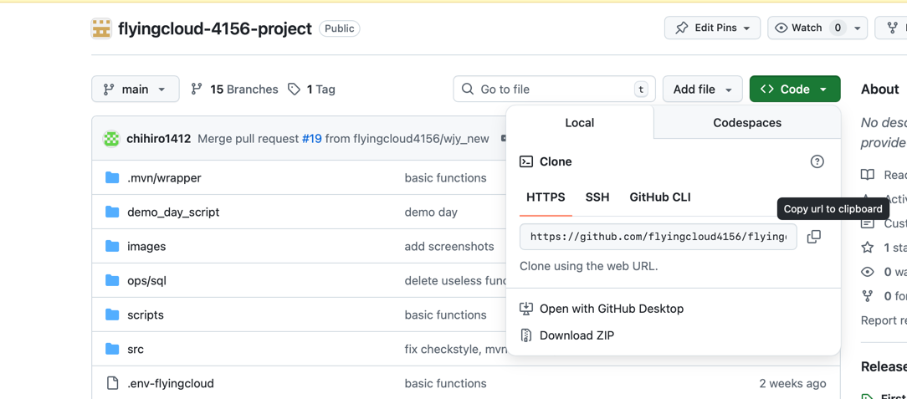

This file is used to guide you run the project locally.

**Clone repository or download the zip file. Open with IntelliJ IDEA.**



## **Complete Local Setup (No Docker)**

### **Step 1: Check if Homebrew is installed**

```bash
brew --version
```

**If Homebrew is NOT installed, install it:**

```bash
/bin/bash -c "$(curl -fsSL https://raw.githubusercontent.com/Homebrew/install/HEAD/install.sh)"
```

**If you get permission errors, you might need:**

```bash
sudo chown -R $(whoami) $(brew --prefix)/*
```

---

### **Step 2: Install MySQL**

```bash
brew install mysql
```

**Start MySQL service:**

```bash
brew services start mysql
```

**Check if MySQL is running:**

```bash
brew services list | grep mysql
```

**You should see:**

```
mysql   started
```

**Set up MySQL root password (if prompted):**

```bash
mysql_secure_installation
```

- Press Enter for current password (empty)
- Set new password when prompted
- Answer Y to all security questions

---

### **Step 3: Install Redis**

```bash
brew install redis
```

**Start Redis service:**

```bash
brew services start redis
```

**Check if Redis is running:**

```bash
brew services list | grep redis
```

**Test Redis connection:**

```bash
redis-cli ping
```

**Should return:** `PONG`

---

### **Step 4: Check Java Installation**

```bash
java -version
```

**If Java 17 is not installed:**

```bash
brew install openjdk@17
echo 'export PATH="/opt/homebrew/opt/openjdk@17/bin:$PATH"' >> ~/.zshrc
source ~/.zshrc
```

**Verify Java 17:**

```bash
java -version
```

**Should show:** `openjdk version "17.x.x"`

---

### **Step 5: Set Up Database**

```bash
cd /Users/haokunwu/Desktop/4156/team_project/flyingcloud-4156-project
```

**Connect to MySQL and create database:**

```bash
mysql -u root -p
```

**In the MySQL prompt, run:**

```sql
CREATE DATABASE ledger;
SHOW DATABASES;
EXIT;
```

**Load the database schema:**

```bash
mysql -u root -p ledger < ops/sql/ledger_flow.sql
```

**Verify tables were created:**

```bash
mysql -u root -p -e "USE ledger; SHOW TABLES;"
```

**You should see tables like:** `users`, `ledgers`, `transactions`, etc.

---

### **Step 7: Run Spring Boot Application**

**Set environment variables for local services:**

```bash
export DB_URL="jdbc:mysql://localhost:3306/ledger?useSSL=false&serverTimezone=America/New_York&characterEncoding=utf8&allowPublicKeyRetrieval=true"
export DB_USER="root"
export DB_PASS="your_mysql_root_password_here"
export REDIS_HOST="localhost"
export REDIS_PORT="6379"
export REDIS_PASSWORD=""
```

**Verify environment variables are set:**

```bash
echo "DB_URL: $DB_URL"
echo "DB_USER: $DB_USER"
echo "REDIS_HOST: $REDIS_HOST"
```

**Add application.yml file for local run:**

Path: flyingcloud4156/application.yml

```
spring:
  datasource:
    url: jdbc:mysql://localhost:3306/ledger?useSSL=false&allowPublicKeyRetrieval=true&serverTimezone=UTC
    username: your_username
    password: your_password
  jpa:
    hibernate:
      ddl-auto: none
  data:
    redis:
      host: localhost  
      port: 6379       
      password: your_password   
      database: 0     
      timeout: 2000ms   
  redis:
    lettuce:
      pool:
        max-active: 8    
        max-idle: 8      
        min-idle: 0     
        max-wait: -1ms   
```

**Check all services are running:**

```bash
# Check MySQL
brew services list | grep mysql

# Check Redis  
brew services list | grep redis

# Test MySQL connection
mysql -u root -p -e "SELECT 'MySQL is working' as status;"

# Test Redis connection
redis-cli ping

# Check if Spring Boot is responding
curl -s http://localhost:8081 > /dev/null && echo "Spring Boot is running" || echo "Spring Boot is not responding"
```

**Run the Spring Boot application:**

```bash
cd ~/code/flyingcloud-4156-project/

./mvnw spring-boot:run
```

**You should see output like:**

```
[INFO] Scanning for projects...
[INFO] 
[INFO] --------------------< dev.coms4156.project:individualproject >--------------------
[INFO] Building individualproject 0.0.1-SNAPSHOT
[INFO] --------------------------------[ jar ]---------------------------------
...
[INFO] Started Application in X.XXX seconds (JVM running for X.XXX)
```

---

### Step 8: Test the Application

You can run bash scripts in **flyingcloud4156/MacBook_first_iteration_demo** and see results in terminal.

```

cd ~/code/flyingcloud-4156-project/MacBook_first_iteration_demo

LOGDIR="logs"
mkdir -p "$LOGDIR"
LOGFILE="$LOGDIR/all_tests_$(date +%Y%m%d_%H%M%S).log"

chmod +x -- ./*.sh(N)

for f in \
  test_income_transaction_equal.sh \
  test_expense_transaction_exact.sh \
  test_expense_transaction_percent.sh \
  test_expense_transaction_weight.sh
do
    echo ">>> Running $f" | tee -a "$LOGFILE"
    bash "$f" 2>&1 | tee -a "$LOGFILE"
    echo ">>> Finished $f" | tee -a "$LOGFILE"
    echo "----------------------------------------" | tee -a "$LOGFILE"
done

echo "All done. Log saved to: $LOGFILE"

```


## **Summary**

**Completely local setup** with:

- ✅ MySQL running locally (port 3306)
- ✅ Redis running locally (port 6379)
- ✅ Spring Boot app running locally (port 8081)
- ✅ Database initialized with ledger schema
- ✅ API endpoints working
- ✅ Swagger documentation available

**No Docker required!** Everything runs natively on your Mac.

**To stop services when you're done:**

```bash
# Stop Spring Boot: Ctrl+C in the terminal where it's running
# Stop MySQL:
brew services stop mysql

# Stop Redis:
brew services stop redis
```

**To start services again later:**

```bash
brew services start mysql
brew services start redis
# Then run the app with the same environment variables
```

Let us know if you encounter any issues with any of these steps!