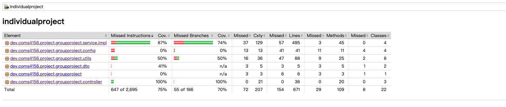
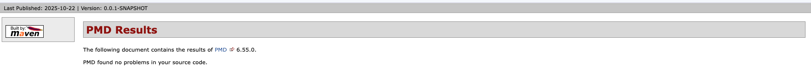
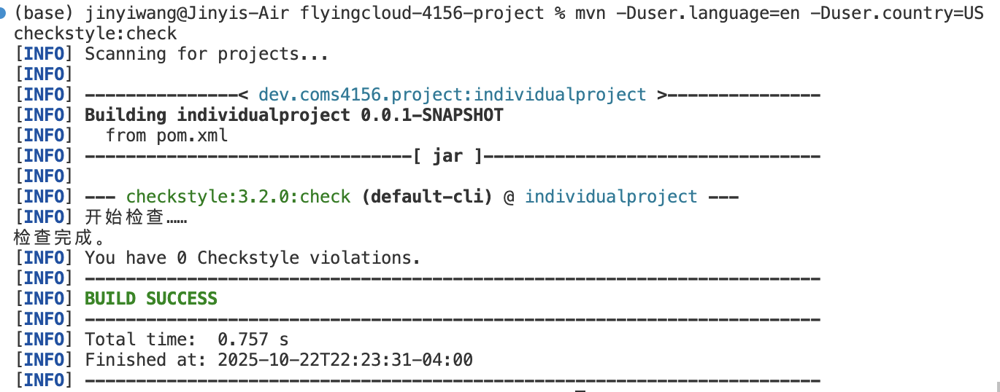

# COMS-4156-Project
This is the GitHub repository for the **service portion** of the Team Project associated with COMS 4156 Advanced Software Engineering. Our team name is flycloud and the following are our members: Ziheng Huang, Zhelin Fan, Jingyi Wang, and Haokun Wu.

## Overview
It is a financial management and settlement service that streamlines expense tracking, budgeting, and multi-party debt settlement. It allows users to record, categorize, and analyze transactions through a unified API that supports different clients—from personal trip-splitting and dorm bill apps to workplace reimbursement systems. Built with Java 17 and Spring Boot, it integrates PostgreSQL/MySQL databases, offers documented RESTful APIs via Swagger UI, and supports automated testing and deployment through Docker and Google Cloud.

## Building and Running Instructions
In order to build this project you must install the following:
1. Maven 3.9.9: https://maven.apache.org/download.cgi
   Download and follow the instructions for MacOS or Window, and set the bin as a new path variable by editing the system variables .
3. JDK 17: https://www.oracle.com/java/technologies/javase/jdk17-0-13-later-archive-downloads.html 
   The project used JDK17 for development. It is recommended to use JDK 17 or another suitable version of the JDK.
4. IntelliJ IDE: https://www.jetbrains.com/idea/download/?section=mac
   IntelliJ is the recommended IDE, but you are welcome to use any alternative that suits you.
After you download on your local machine, you can open IntelliJ IDEA to clone the Github repo. 
1. Click the green code button, copy the http line and give it to your IDE to clone.
   [img]
2. After cloning the repo, you can build the project with Maven using the following command.
   <code>mvn clean install</code>
3. Then you can run the project using the command.

   <code>mvn compile</code>
   
   <code>mvn spring-boot:run</code>

## Running a Macbook Based Instance (Iteration 1)
please read
[run_local_guide.md](MacBook_first_iteration_demo/run_local_guide.md)

## Running a Cloud Based Instance (Iteration 2)
You can reach our service through cloud.

## Endpoints of First Iteration
This section describes the endpoints provided by this project, along with their corresponding inputs and outputs.

#### POST /api/v1/auth/register
* Expected Input Parameters: JSON object (RegisterRequest) containing the following fields
 * email (string): the user’s email address
 * password (string): the user’s password
 * name (string): the user’s display name
 * Expected Output: A JSON object (Result<Void>) indicating registration success
* Upon Success: HTTP 200 Status Code returned with success message in JSON
* Upon Failure:
  * HTTP 400 Status Code with “Invalid input.”
  * HTTP 409 Status Code with “User already exists.”

#### POST /api/v1/auth/login
* Expected Input Parameters: JSON object (LoginRequest) containing the following fields
  * email (string): the user’s email address
  * password (string): the user’s password
* Expected Output: A JSON object (TokenPair) containing the following fields
  * accessToken (string): short-lived access token
  * refreshToken (string): long-lived refresh token
* Upon Success: HTTP 200 Status Code returned along with token pair in JSON
* Upon Failure:
  * HTTP 401 Status Code with “Invalid email or password.”
  * HTTP 500 Status Code with “Error occurred during login.”

#### POST /api/v1/auth/refresh
* Expected Input Parameters:
  * refreshToken (string): existing refresh token
* Expected Output: A JSON object (TokenPair) containing the following fields
  * accessToken (string): new short-lived token
  * refreshToken (string): new long-lived token
* Upon Success: HTTP 200 Status Code returned with refreshed tokens
* Upon Failure:
  * HTTP 401 Status Code with “Invalid or expired refresh token.”
  * HTTP 500 Status Code with “Error occurred while refreshing token.”

#### POST /api/v1/auth/logout
* Expected Input Parameters:
  * refreshToken (string): refresh token to invalidate
* Expected Output: A JSON object (Result<Void>) confirming logout
* Upon Success: HTTP 200 Status Code with “Logout successful.”
* Upon Failure:
  * HTTP 400 Status Code with “Invalid refresh token.”
  * HTTP 500 Status Code with “Error occurred during logout.”

#### GET /api/v1/user-lookup
* Expected Input Parameters:
  * email (string): user’s email address
* Expected Output: A JSON object (UserLookupResponse) containing the following fields
  * id (long): user ID
  * name (string): user display name
  * email (string): user email
  * exists (boolean): whether the user exists
* Upon Success: HTTP 200 Status Code returned with user lookup data in JSON
* Upon Failure:
  * HTTP 404 Status Code with “User not found.”
  * HTTP 500 Status Code with “Error occurred during user lookup.”

#### GET /api/v1/users/me
* Expected Input Parameters:
  * Header:
  * X-Auth-Token (string): access token
* Expected Output: A JSON object (UserView) containing the following fields
  * id (long): current user ID
  * name (string): user name
* Upon Success: HTTP 200 Status Code returned with user info in JSON
* Upon Failure:
  * HTTP 401 Status Code with “Unauthorized or expired token.”

#### GET /api/v1/users/{id}
* Expected Input Parameters:
  * id (long): unique user ID
* Expected Output: A JSON object (UserView) containing the following fields
  * id (long): user ID
  * name (string): user display name
  * email (string): user email
* Upon Success: HTTP 200 Status Code returned with user profile in JSON
* Upon Failure:
  * HTTP 404 Status Code with “User not found.”
  * HTTP 500 Status Code with “Error occurred while retrieving user profile.”

#### POST /api/v1/ledgers
* Expected Input Parameters: JSON object containing the following fields
  * name (string): the name of the ledger
  * description (string): the description of the ledger
* Expected Output: A JSON object (LedgerResponse) containing the created ledger information
* Upon Success: HTTP 201 Status Code returned along with ledger object in JSON
* Upon Failure:
  * HTTP 400 Status Code with "Invalid input."
  * HTTP 500 Status Code with "Error occurred while creating ledger."

#### GET /api/v1/ledgers/mine
* Expected Input Parameters: N/A
* Expected Output: A JSON object (MyLedgersResponse) containing the list of ledgers owned or joined by the current user
* Upon Success: HTTP 200 Status Code returned with ledger list in JSON
* Upon Failure:
  * HTTP 500 Status Code with "Error occurred while retrieving user ledgers."

#### GET /api/v1/ledgers/{ledgerId}
* Expected Input Parameters:
  * ledgerId (long): the unique identifier of the ledger
* Expected Output: A JSON object (LedgerResponse) containing the details of the ledger
* Upon Success: HTTP 200 Status Code returned along with ledger details in JSON
* Upon Failure:
  * HTTP 404 Status Code with "Ledger not found."
  * HTTP 500 Status Code with "Error occurred while retrieving ledger details."

#### POST /api/v1/ledgers/{ledgerId}/members
* Expected Input Parameters: JSON object (AddLedgerMemberRequest) containing the following fields
  * userId (long): the ID of the user to add
  * role (string): the role of the member in the ledger
* Expected Output: A JSON object (LedgerMemberResponse) containing the added member information
* Upon Success: HTTP 201 Status Code returned along with member object in JSON
* Upon Failure:
  * HTTP 400 Status Code with "Invalid input."
  * HTTP 404 Status Code with "Ledger not found."
  * HTTP 500 Status Code with "Error occurred while adding member."

#### GET /api/v1/ledgers/{ledgerId}/members
* Expected Input Parameters:
  * ledgerId (long): the unique identifier of the ledger
* Expected Output: A JSON object (ListLedgerMembersResponse) containing the list of all members in the ledger
* Upon Success: HTTP 200 Status Code returned along with member list in JSON
* Upon Failure:
  * HTTP 404 Status Code with "Ledger not found."
  * HTTP 500 Status Code with "Error occurred while retrieving members."

#### DELETE /api/v1/ledgers/{ledgerId}/members/{userId}
* Expected Input Parameters:
  * ledgerId (long): the unique identifier of the ledger
  * userId (long): the unique identifier of the user to remove
* Expected Output: A JSON object (Result<Void>) indicating the removal result
* Upon Success: HTTP 204 Status Code returned with no content
* Upon Failure:
  * HTTP 404 Status Code with "Ledger or user not found."
  * HTTP 500 Status Code with "Error occurred while removing member."

#### POST /api/v1/ledgers/{ledgerId}/transactions
* Expected Input Parameters: JSON object (CreateTransactionRequest) containing the following fields
  * type (string): transaction type (EXPENSE, INCOME, LOAN)
  * title (string): title or description of the transaction
  * totalAmount (decimal): total amount of the transaction
  * splits (list): list of participant split details
  * createdBy (long): ID of the user who created the transaction
  * categoryId (long, optional): category ID for expense categorization
* Expected Output: A JSON object (CreateTransactionResponse) containing:
  * transactionId (long): ID of the created transaction
  * budgetAlert (string, optional): budget warning/alert message if spending approaches or exceeds budget limit (only for EXPENSE transactions)
* Upon Success: HTTP 201 Status Code returned along with transaction object in JSON
* Upon Failure:
  * HTTP 400 Status Code with "Invalid input."
  * HTTP 404 Status Code with "Ledger not found."
  * HTTP 500 Status Code with "Error occurred while creating transaction."

#### GET /api/v1/ledgers/{ledgerId}/transactions/{transactionId}
* Expected Input Parameters:
  * ledgerId (long): the unique identifier of the ledger
  * transactionId (long): the unique identifier of the transaction
* Expected Output: A JSON object (TransactionResponse) containing the detailed transaction information including splits and debt edges
* Upon Success: HTTP 200 Status Code returned along with transaction details in JSON
* Upon Failure:
  * HTTP 404 Status Code with "Transaction not found."
  * HTTP 500 Status Code with "Error occurred while retrieving transaction details."

#### GET /api/v1/ledgers/{ledgerId}/transactions
* Expected Input Parameters:
  * ledgerId (long): the unique identifier of the ledger
  * page (integer): page number (default 1)
  * size (integer): page size (max 200, default 50)
  * from (string): start date filter (ISO 8601 format)
  * to (string): end date filter (ISO 8601 format)
  * type (string): transaction type filter (EXPENSE, INCOME, LOAN)
  * created_by (long): user ID filter for transaction creator
* Expected Output: A JSON object (ListTransactionsResponse) containing paginated transaction list
* Upon Success: HTTP 200 Status Code returned with transaction list in JSON
* Upon Failure:
  * HTTP 404 Status Code with "Ledger not found."
  * HTTP 500 Status Code with "Error occurred while listing transactions."

#### POST /api/v1/ledgers/{ledgerId}/budgets
* Expected Input Parameters: JSON object (SetBudgetRequest) containing the following fields
  * categoryId (long, optional): category ID for category-specific budget (null for ledger-level budget)
  * year (integer): budget year (2020-2100)
  * month (integer): budget month (1-12)
  * limitAmount (decimal): budget limit amount (minimum 0.01)
* Expected Output: A JSON object (Result<Void>) indicating budget creation/update success
* Upon Success: HTTP 200 Status Code returned with success message in JSON
* Upon Failure:
  * HTTP 400 Status Code with "Invalid input."
  * HTTP 401 Status Code with "Not logged in."
  * HTTP 403 Status Code with "Insufficient permissions. Only OWNER or ADMIN can set budgets."
  * HTTP 404 Status Code with "Ledger not found."
  * HTTP 500 Status Code with "Error occurred while setting budget."

#### GET /api/v1/ledgers/{ledgerId}/budgets/status
* Expected Input Parameters:
  * ledgerId (long): the unique identifier of the ledger
  * year (integer): budget year to query
  * month (integer): budget month to query (1-12)
* Expected Output: A JSON object (BudgetStatusResponse) containing a list of budget status items, each with:
  * budgetId (long): unique budget ID
  * categoryId (long, optional): category ID (null for ledger-level budget)
  * categoryName (string): category display name or "Total Budget"
  * limitAmount (decimal): budget limit amount
  * spentAmount (decimal): total spent amount
  * ratio (string): usage ratio as decimal string (e.g., "0.8500" for 85%)
  * status (string): budget status - "OK" (< 80%), "NEAR_LIMIT" (80-99%), or "EXCEEDED" (≥ 100%)
* Upon Success: HTTP 200 Status Code returned with budget status list in JSON
* Upon Failure:
  * HTTP 401 Status Code with "Not logged in."
  * HTTP 403 Status Code with "Not a member of this ledger."
  * HTTP 500 Status Code with "Error occurred while retrieving budget status."

## Unit Testing
- Testing framework: JUnit. 
- Mocking framework: Mockito. 
- Configuration files: pom.xml(Main confiduration), Mockito to enable inline mocking (src/test/resources/mockito-extensions/org.mockito.plugins.MockMaker).

The testing and mocking frameworks are configured via Maven dependencies defined in pom.xml. No additional manual setup is required — Maven automatically downloads and integrates JUnit and Mockito during the build process.
Our unit tests are located under the directory 'src/test'. You can choose any of the classes present in the src/test directory and click run to see the results.

## API Testing
We use automated Bash scripts for API-level testing to validate the service endpoints and ensure consistent behavior across multiple clients.
- Bash Script File: [final_api_tests_complete.sh]()
- Result and Report File: [api_test_results.md]()

To run the full automated API test suite:

<code>bash final_api_tests_fixed.sh</code>

**Note: API tests are run manually and are not automated in the CI pipeline.** This is because API tests require:
- A running database instance (MySQL) with specific test data
- A running Spring Boot application server
- Authentication tokens that expire and need to be refreshed during test execution
- Complex state management across multiple API calls (e.g., creating users, then using their tokens)
- Manual verification of complex workflows that are difficult to automate in a CI environment

While these tests could theoretically be automated in CI, it would require setting up database containers, managing application lifecycle, and handling authentication state, which adds significant complexity. The bash scripts provide a practical way to test the complete API workflow manually while still being automated in execution.

Before using bash scripts to test,we've also used Postman to test some APIs ,you can access the test cases here: https://swjy1412-6196945.postman.co/workspace/Jinyi-Wang's-Workspace~67097b2f-bdc0-4997-8ef5-9b20805b25b5/collection/49421217-e21193f8-cfc5-4f6b-bef2-d9b136d6f83d?action=share&source=copy-link&creator=49421217
However due to authentication and database issues, this test cases are not easy to be replicated on local machines, so we switched to using bash scripts.

## Branch Coverage Report
You can run the command to run all the tests and check the coverage report located in target/site/jacoco/index.html

<code>mvn clean test verify</code>

## Static Code Analysis
Run mvn pmd:pmd to generate the static code analysis and check the report in target/site/pmd.html.

## Style Check Report
We used the command <code>mvn checktyle:check</code> to check the style of our code and generate style checking. 

## Tool Used
* Checkstyle
  * We use Checkstyle for code reporting. Checkstyle IS run as part of the CI pipeline (see `.github/workflows/ci.yml`).
  * For running Checkstyle manually, you can use the "Checkstyle-IDEA" plugin for IntelliJ or run `mvn checkstyle:check`.
* PMD
  * We are using PMD to do static analysis of our Java code.
  * Originally we were planning on using SonarQube, however we did not do this as it requires us to either pay or setup a server to host a SonarQube instance.
* JUnit
  * JUnit tests get run automatically as part of the CI pipeline.
* JaCoCo
  * We use JaCoCo for generating code coverage reports.
  * Originally we were planning on using Cobertura, however Cobertura does not support our version of Java.

## AI Documentation(待修改)
We use AI to generate an initial API test script and then manually reviewed and modified it.
* Prompt(Generate API Test Script): Please generate automated API tests for several APIs defined in my project’s Java controller files, such as AuthController, LedgerController, and TransactionController. I would like to perform these tests using Bash, so please write a complete Bash script. The script should automatically reset and import the MySQL database by executing the schema and seed SQL files, use curl to send HTTP requests, and employ jq to parse JSON responses. It needs to extract key fields such as tokens and IDs, stop execution when an API call fails, and display clear success and failure messages in the output. Each test section should also include a descriptive title and separator lines for readability.

