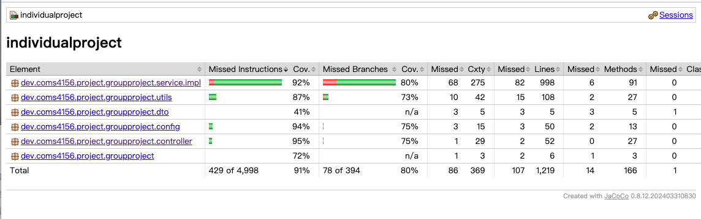
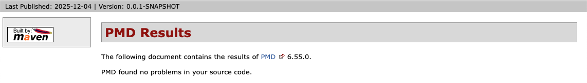
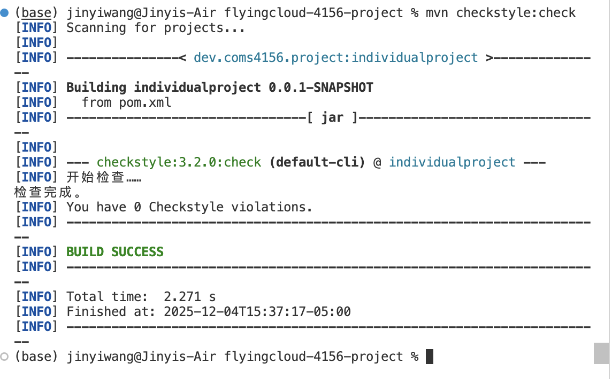

# COMS-4156-Project
This is the GitHub repository for the **service portion** of the Team Project associated with COMS 4156 Advanced Software Engineering. Our team name is flycloud and the following are our members: Ziheng Huang, Zhelin Fan, Jingyi Wang, and Haokun Wu.

# 1. Project Overview
It is a financial management and settlement service that streamlines expense tracking, budgeting, and multi-party debt settlement(). 
  It allows users to record, categorize, and analyze transactions through a unified API that supports different clients—from personal trip-splitting and dorm bill apps to workplace reimbursement systems. 
  Built with Java 17 and Spring Boot, it integrates PostgreSQL/MySQL databases, offers documented RESTful APIs via Swagger UI, and supports automated testing and deployment through Docker and Google Cloud.

The following summarizes the implementation status relative to our original proposal. Detailed descriptions of each feature remain in the original proposal document.
### **Implemented**

- Budget management & alerts
- Cross-settlement for N-party debts
- Analytics & visualization
- Rule-based recommendations (non-AI)

### **Not Implemented / Removed**

- Bill parsing (OCR / AI-based)
- Automatic categorization (AI-based)

### **Reason for Removing AI Components**

We removed all AI-dependent features because they introduce non-deterministic behavior and make rigorous testing difficult, which is not aligned with the course requirements.
The remaining feature set fully supports a complete and testable workflow.
We have consulted the professor regarding this adjustment, and received approval to proceed with removing the AI components.


# 2. Building and Running Instructions

（原节保留，但需新增 CI 相关说明）

## 2.1 Local Development Setup

- JDK17、Maven、IDE 说明（保留原文字）
- 如何在本地运行服务：`mvn clean install`, `mvn spring-boot:run`
- 本地运行数据库（MySQL/PostgreSQL）的说明
- 配置环境变量（如有）

## 2.2 Running a Macbook Based Instance (Iteration 1)

（保留原链接）

## 2.3 Running a Cloud Based Instance (Iteration 2)

（必须扩展：课程要求）

内容必须包括：

- GCP 部署方式（Cloud Run / Cloud SQL / VPC Connector）
- 可访问的 service URL
- 如何验证部署在云端的实例正在运行
- 导师访问方式（无需账号则说明）


# 3. API Documentation

#### POST /api/v1/auth/register
* Expected Input Parameters: JSON object (RegisterRequest) containing the following fields
 * email (string): the user’s email address
 * password (string): the user’s password
 * name (string): the user’s display name
 * Expected Output: A JSON object (Result<Void>) indicating registration success
* Upon Success: HTTP 200 Status Code returned with success message in JSON
* Upon Failure:
  * HTTP 400 Status Code with “Invalid input.”
  * HTTP 409 Status Code with “User already exists.”

#### POST /api/v1/auth/login
* Expected Input Parameters: JSON object (LoginRequest) containing the following fields
  * email (string): the user’s email address
  * password (string): the user’s password
* Expected Output: A JSON object (TokenPair) containing the following fields
  * accessToken (string): short-lived access token
  * refreshToken (string): long-lived refresh token
* Upon Success: HTTP 200 Status Code returned along with token pair in JSON
* Upon Failure:
  * HTTP 401 Status Code with “Invalid email or password.”
  * HTTP 500 Status Code with “Error occurred during login.”

#### POST /api/v1/auth/refresh
* Expected Input Parameters:
  * refreshToken (string): existing refresh token
* Expected Output: A JSON object (TokenPair) containing the following fields
  * accessToken (string): new short-lived token
  * refreshToken (string): new long-lived token
* Upon Success: HTTP 200 Status Code returned with refreshed tokens
* Upon Failure:
  * HTTP 401 Status Code with “Invalid or expired refresh token.”
  * HTTP 500 Status Code with “Error occurred while refreshing token.”

#### POST /api/v1/auth/logout
* Expected Input Parameters:
  * refreshToken (string): refresh token to invalidate
* Expected Output: A JSON object (Result<Void>) confirming logout
* Upon Success: HTTP 200 Status Code with “Logout successful.”
* Upon Failure:
  * HTTP 400 Status Code with “Invalid refresh token.”
  * HTTP 500 Status Code with “Error occurred during logout.”

#### GET /api/v1/user-lookup
* Expected Input Parameters:
  * email (string): user’s email address
* Expected Output: A JSON object (UserLookupResponse) containing the following fields
  * id (long): user ID
  * name (string): user display name
  * email (string): user email
  * exists (boolean): whether the user exists
* Upon Success: HTTP 200 Status Code returned with user lookup data in JSON
* Upon Failure:
  * HTTP 404 Status Code with “User not found.”
  * HTTP 500 Status Code with “Error occurred during user lookup.”

#### GET /api/v1/users/me
* Expected Input Parameters:
  * Header:
  * X-Auth-Token (string): access token
* Expected Output: A JSON object (UserView) containing the following fields
  * id (long): current user ID
  * name (string): user name
* Upon Success: HTTP 200 Status Code returned with user info in JSON
* Upon Failure:
  * HTTP 401 Status Code with “Unauthorized or expired token.”

#### GET /api/v1/users/{id}
* Expected Input Parameters:
  * id (long): unique user ID
* Expected Output: A JSON object (UserView) containing the following fields
  * id (long): user ID
  * name (string): user display name
  * email (string): user email
* Upon Success: HTTP 200 Status Code returned with user profile in JSON
* Upon Failure:
  * HTTP 404 Status Code with “User not found.”
  * HTTP 500 Status Code with “Error occurred while retrieving user profile.”

#### POST /api/v1/ledgers
* Expected Input Parameters: JSON object containing the following fields
  * name (string): the name of the ledger
  * description (string): the description of the ledger
* Expected Output: A JSON object (LedgerResponse) containing the created ledger information
* Upon Success: HTTP 201 Status Code returned along with ledger object in JSON
* Upon Failure:
  * HTTP 400 Status Code with "Invalid input."
  * HTTP 500 Status Code with "Error occurred while creating ledger."


#### GET /api/v1/ledgers/mine
* Expected Input Parameters: N/A
* Expected Output: A JSON object (MyLedgersResponse) containing the list of ledgers owned or joined by the current user
* Upon Success: HTTP 200 Status Code returned with ledger list in JSON
* Upon Failure:
  * HTTP 500 Status Code with "Error occurred while retrieving user ledgers."

#### GET /api/v1/ledgers/{ledgerId}
* Expected Input Parameters:
  * ledgerId (long): the unique identifier of the ledger
* Expected Output: A JSON object (LedgerResponse) containing the details of the ledger
* Upon Success: HTTP 200 Status Code returned along with ledger details in JSON
* Upon Failure:
  * HTTP 404 Status Code with "Ledger not found."
  * HTTP 500 Status Code with "Error occurred while retrieving ledger details."

#### POST /api/v1/ledgers/{ledgerId}/members
* Expected Input Parameters: JSON object (AddLedgerMemberRequest) containing the following fields
  * userId (long): the ID of the user to add
  * role (string): the role of the member in the ledger
* Expected Output: A JSON object (LedgerMemberResponse) containing the added member information
* Upon Success: HTTP 201 Status Code returned along with member object in JSON
* Upon Failure:
  * HTTP 400 Status Code with "Invalid input."
  * HTTP 404 Status Code with "Ledger not found."
  * HTTP 500 Status Code with "Error occurred while adding member."

#### GET /api/v1/ledgers/{ledgerId}/members
* Expected Input Parameters:
  * ledgerId (long): the unique identifier of the ledger
* Expected Output: A JSON object (ListLedgerMembersResponse) containing the list of all members in the ledger
* Upon Success: HTTP 200 Status Code returned along with member list in JSON
* Upon Failure:
  * HTTP 404 Status Code with "Ledger not found."
  * HTTP 500 Status Code with "Error occurred while retrieving members."

#### DELETE /api/v1/ledgers/{ledgerId}/members/{userId}
* Expected Input Parameters:
  * ledgerId (long): the unique identifier of the ledger
  * userId (long): the unique identifier of the user to remove
* Expected Output: A JSON object (Result<Void>) indicating the removal result
* Upon Success: HTTP 204 Status Code returned with no content
* Upon Failure:
  * HTTP 404 Status Code with "Ledger or user not found."
  * HTTP 500 Status Code with "Error occurred while removing member."

#### POST /api/v1/ledgers/{ledgerId}/transactions
* Expected Input Parameters: JSON object (CreateTransactionRequest) containing the following fields
  * type (string): transaction type (EXPENSE, INCOME, LOAN)
  * title (string): title or description of the transaction
  * totalAmount (decimal): total amount of the transaction
  * splits (list): list of participant split details
  * createdBy (long): ID of the user who created the transaction
  * categoryId (long, optional): category ID for expense categorization
* Expected Output: A JSON object (CreateTransactionResponse) containing:
  * transactionId (long): ID of the created transaction
  * budgetAlert (string, optional): budget warning/alert message if spending approaches or exceeds budget limit (only for EXPENSE transactions)
* Upon Success: HTTP 201 Status Code returned along with transaction object in JSON
* Upon Failure:
  * HTTP 400 Status Code with "Invalid input."
  * HTTP 404 Status Code with "Ledger not found."
  * HTTP 500 Status Code with "Error occurred while creating transaction."

#### GET /api/v1/ledgers/{ledgerId}/transactions/{transactionId}
* Expected Input Parameters:
  * ledgerId (long): the unique identifier of the ledger
  * transactionId (long): the unique identifier of the transaction
* Expected Output: A JSON object (TransactionResponse) containing the detailed transaction information including splits and debt edges
* Upon Success: HTTP 200 Status Code returned along with transaction details in JSON
* Upon Failure:
  * HTTP 404 Status Code with "Transaction not found."
  * HTTP 500 Status Code with "Error occurred while retrieving transaction details."

#### GET /api/v1/ledgers/{ledgerId}/transactions
* Expected Input Parameters:
  * ledgerId (long): the unique identifier of the ledger
  * page (integer): page number (default 1)
  * size (integer): page size (max 200, default 50)
  * from (string): start date filter (ISO 8601 format)
  * to (string): end date filter (ISO 8601 format)
  * type (string): transaction type filter (EXPENSE, INCOME, LOAN)
  * created_by (long): user ID filter for transaction creator
* Expected Output: A JSON object (ListTransactionsResponse) containing paginated transaction list
* Upon Success: HTTP 200 Status Code returned with transaction list in JSON
* Upon Failure:
  * HTTP 404 Status Code with "Ledger not found."
  * HTTP 500 Status Code with "Error occurred while listing transactions."

#### POST /api/v1/ledgers/{ledgerId}/budgets
* Expected Input Parameters: JSON object (SetBudgetRequest) containing the following fields
  * categoryId (long, optional): category ID for category-specific budget (null for ledger-level budget)
  * year (integer): budget year (2020-2100)
  * month (integer): budget month (1-12)
  * limitAmount (decimal): budget limit amount (minimum 0.01)
* Expected Output: A JSON object (Result<Void>) indicating budget creation/update success
* Upon Success: HTTP 200 Status Code returned with success message in JSON
* Upon Failure:
  * HTTP 400 Status Code with "Invalid input."
  * HTTP 401 Status Code with "Not logged in."
  * HTTP 403 Status Code with "Insufficient permissions. Only OWNER or ADMIN can set budgets."
  * HTTP 404 Status Code with "Ledger not found."
  * HTTP 500 Status Code with "Error occurred while setting budget."

#### GET /api/v1/ledgers/{ledgerId}/budgets/status
* Expected Input Parameters:
  * ledgerId (long): the unique identifier of the ledger
  * year (integer): budget year to query
  * month (integer): budget month to query (1-12)
* Expected Output: A JSON object (BudgetStatusResponse) containing a list of budget status items, each with:
  * budgetId (long): unique budget ID
  * categoryId (long, optional): category ID (null for ledger-level budget)
  * categoryName (string): category display name or "Total Budget"
  * limitAmount (decimal): budget limit amount
  * spentAmount (decimal): total spent amount
  * ratio (string): usage ratio as decimal string (e.g., "0.8500" for 85%)
  * status (string): budget status - "OK" (< 80%), "NEAR_LIMIT" (80-99%), or "EXCEEDED" (≥ 100%)
* Upon Success: HTTP 200 Status Code returned with budget status list in JSON
* Upon Failure:
  * HTTP 401 Status Code with "Not logged in."
  * HTTP 403 Status Code with "Not a member of this ledger."
  * HTTP 500 Status Code with "Error occurred while retrieving budget status."


# 4. Client Application


## 4.1 Where the Client Code Lives

You can find the client code in 'flyingcloud-4156-project/frontend'.


## 4.2 What the Client Does

The client is a lightweight web application that demonstrates how users interact with the service.
It provides:

- **User authentication** (login flow using the service’s auth API)
- **Ledger selection and management**
- **Creating and viewing transactions**, including split details
- **Budget visualization**, showing spending and alert messages returned from the API
- **Analytics display** such as category breakdowns and spending trends
- **Flexible Settlement plan rendering** based on backend-generated results

These interactions are all performed by invoking the service’s REST API endpoints.

## 4.3 Building & Running the Client

From the frontend directory, you may start a local development server using any static file server.

```
npm start
```
If you use the frontend on the cloud side, just use the link(http://136.114.83.248:3000/) to enter the login page

## 4.4 How Multiple Client Instances Interact with the Service

- Client identification
Each client instance obtains its own access token after login.
The service distinguishes clients entirely based on the access token, which encodes user identity.
No client-side session sharing is required.
- How to test multiple instances of the client connect to the service at the same time 
Remember to use **two different browser** to test due to that a browser will have a same localStorage.
When you refresh a browser. Two windows(login with different user info) will become one user's window.
- Shared ledger interactions
Multiple clients can view or modify the same ledger concurrently.
The service ensures consistency through persistent storage (MySQL/Cloud SQL), so updates from one client become visible to others when they refresh or make subsequent API calls.


# 5. End-to-End Client/Service Testing


## 5.1 Purpose

The goal of our end-to-end (E2E) tests is to validate the **entire workflow** from the user's perspective:

- A user interacts only with the **HTML/JavaScript client** (`index.html` for login and `dashboard.html` for the main UI).
- The client issues real HTTP requests (via `fetch`) to the deployed service API.
- The service executes the full business logic, persists data in the database, and returns results.
- The client renders these results back into the UI (tables, charts, budget banner, settlement modal, etc.).

These tests treat the system as a **black box**: we do not call service methods or APIs directly during E2E testing.
Instead, we drive the browser UI and observe the visible outcomes. The tests are **manual but deterministic**, as allowed by the course requirements.


## 5.2 E2E Test Checklist

The following scenarios form our manual E2E regression checklist. They are designed to be followed step-by-step in a browser.

#### Scenario A – Single-User Ledger & Analytics Workflow

1. **Open the login page**

    - Local: 
      Use link(http://localhost:3000) to enter the login page.
    - Cloud:
      Use link() to enter the login page. 
2. **Log in as an existing user (e.g., Alice)**

    - Enter a valid email and password(Set as ‘Passw0rd!’).
    - Click **Login**.
    - Verify that the client redirects to `dashboard.html`.

3. **Verify current user**

    - On the left sidebar, check **“Current user:”**.
    - Confirm it shows `Alice` (or the logged-in user name), proving the token is valid and the client can fetch user info.

4. **Create a new ledger**

    - In the left sidebar, click **“Add new ledger”**.
    - The **“Create new ledger”** modal appears in the center.
    - Fill in the form:
        - **Name:** e.g., `Family 2025`
        - **Type:** `GROUP_BALANCE`
        - **Base currency:** `USD`
        - **Categories:** type category names such as `Food`, `Gas`, `Entertainment`, pressing Enter after each
        - **Share start date:** keep the default date
    - Click **Create**.
    - Verify:
        - The new ledger appears in the **“Ledger”** dropdown at the top.
        - The ledger info box shows the correct type (`GROUP_BALANCE`), currency (`USD`), and role (`OWNER`).

5. **Create a new expense transaction**

    - Ensure the newly created ledger is selected in the **“Ledger”** dropdown.
    - Click **“Add transaction”** on the **Transactions** panel.
    - The **“Create transaction”** modal appears.
    - Fill in:
        - **Type:** `Expense`
        - **Amount:** e.g., `100`
        - **Category:** choose one of the categories (e.g., `Gas`)
        - **Currency:** `USD`
        - **Date / time:** keep the pre-filled current date/time
        - **Payer:** `Alice`
        - **Note:** e.g., `Gas – Nov 18`
        - **Split method:** `Equal shares`
        - **Splits:** make sure all members are checked in the list (Alice, Bob, Charlie, Diana if present)
    - Click **Create**.
    - Verify:
        - The modal closes without error.
        - A new row appears in the **Transactions** table with the correct **Date**, **Type = EXPENSE**, **Note**, and **Amount**.

6. **Inspect transaction details**

    - In the **Transactions** table, find the row just created.
    - Click the **“View”** button in the **Actions** column.
    - The **“Transaction details”** modal appears.
    - Verify:
        - Type, Amount, Currency, Date/time, Payer, Category, and Note match what was entered.
        - The **Splits** list shows each user with the correct share (e.g., 25.00 USD each for four users with equal shares).

7. **Verify budget banner**

    - Above the Transactions panel, look at the **budget / status banner** (e.g., `Budget: …` or `SPEND_TOO_HIGH: Expenses …`).
    - When a new ledger is created, its original budget is 0. User can set it after creation.
    - Verify that:
        - The total expense value includes the newly created transaction.
        - If thresholds are configured, the status text changes appropriately (e.g., from normal to `SPEND_TOO_HIGH`).

8. **Edit ledger budget** *(from original Scenario C)*

   - Click **Edit** on the budget banner
   - Enter a new amount (e.g., 300)
   - Save
   - Verify:
       - Banner updates
       - Status text recalculated
       - Charts still correct after budget changes
     
9. **Verify analytics charts**

    - On the right side of the dashboard:
        - Check the **“Income / Expense Analytics”** line chart:
            - The **Expense** line should include the new split expense(total 100 USD) in the appropriate month.
        - Check the **“Expense by Category”** pie chart:
            - The `Gas` part value is changed(You can compare with the value before a new transaction is added).
    - This confirms that analytics endpoints are called and the client correctly visualizes the returned data.

10. **Logout**

    - In the left sidebar, click **Logout**.
    - Verify that:
        - The access token is cleared (no authenticated requests succeed afterward).
        - The browser is redirected back to `index.html`.


#### Scenario B – Members & Debt Settlement Workflow

1. **Log in and select an existing shared ledger**

    - Log in again as **Alice** and go to `dashboard.html`.
    - In the **“Ledger”** dropdown, select a ledger that already has multiple members and transactions (e.g., `Road Trip Demo (USD)`).

2. **Manage members**(Only `OWNER` has this right.)

    - Click the **“Manage members”** button at the top right of the ledger section.
    - The **“Manage members”** modal appears.
    - In **“Add a member (email)”**, enter a valid email (e.g., `gina@example.com`) and click **Add**.
    - Verify:
        - The new member appears in the **Current members** list with the appropriate role (e.g., `EDITOR`).
    - In the same modal, **Remove an existing member**
        - In the same modal, click ✕ next to a non-owner member
        - Confirm dialog
        - Verify the member disappears from the list
3. **Delete an existing transaction** *(from original Scenario C)*

   - In the **Transactions** table, click **✕** on `Expense` transaction
   - Confirm deletion
   - Verify:
       - Row disappears
       - Budget banner updates
       - Analytics charts update accordingly

4. **Open the settlement plan**

    - Click the **“Cross-settlement Debts”** button.
    - The **“Debt Settlement Plan”** modal appears.
    - Verify:
        - The header shows the ledger currency and number of transfers.
        - A default settlement plan is shown at the bottom (list of “X → Y – amount” rows) based on current balances.

5. **Use advanced settlement options**

    - Toggle **“Use advanced options”** to ON.
    - In **Advanced settings**, adjust:
        - **Rounding strategy** (e.g., `Round half up (default)`).
        - **Max transfer per transaction** (optional; leave empty for no cap; e.g., `50`).
        - Optionally check **“Force min-cost flow algorithm”** or set a threshold for fallback.
    - Click **“Generate settlement plan”**.
    - Verify:
        - A settlement plan is regenerated.
        - The list of transfers at the bottom updates and remains consistent (total paid by debtors equals total received by creditors).

6. **Close all modals**

    - Close the **Debt Settlement Plan** modal.
    - Confirm the dashboard returns to the normal state without errors.


#### APIs Exercised by the E2E Tests

The manual E2E scenarios above exercise the following plausible service endpoints:

1. **POST** `/api/v1/auth/login` – user login
2. **GET** `/api/v1/users/me` – fetch current user profile
3. **GET** `/api/v1/user-lookup` – look up a user by email before adding as member
4. **POST** `/api/v1/auth/logout` - user logout
5. **GET** `/api/v1/ledgers/mine` – list ledgers the user belongs to
6. **POST** `/api/v1/ledgers` – create a new ledger
7. **GET** `/api/v1/ledgers/{ledgerId}` – fetch ledger metadata
8. **GET** `/api/v1/ledgers/{ledgerId}/transactions` – list transactions for the ledger
9. **POST** `/api/v1/ledgers/{ledgerId}/transactions` – create a new transaction with splits
10. **GET** `/api/v1/ledgers/{ledgerId}/transactions/{txId}` – view full transaction details
11. **DELETE** `/api/v1/ledgers/{ledgerId}/transactions/{txId}` – delete a transaction
12. **GET** `/api/v1/ledgers/{ledgerId}/members` – list ledger members
13. **POST** `/api/v1/ledgers/{ledgerId}/members` – add a member to the ledger
14. **DELETE** `/api/v1/ledgers/{ledgerId}/members/{userId}` – remove a member
15. **GET** `/api/v1/ledgers/{ledgerId}/settlement-plan` – fetch default settlement plan
16. **POST** `/api/v1/ledgers/{ledgerId}/settlement-plan` – generate advanced settlement plan with custom config
17. **POST** `/api/v1/ledgers/{ledgerId}/budgets` – set or update the monthly budget
18. **GET** `/api/v1/ledgers/{ledgerId}/budgets/status?year={YYYY}&month={MM}` – retrieve current month budget status
19. **GET** `/api/v1/ledgers/{ledgerId}/analytics/overview?months=3` – fetch analytics overview for dashboard charts
20. **POST** `/api/v1/auth/register` - user register(implemented and test well but hard to contain it in workflow)

### 5.3 How to Run E2E Tests

1. **Start the backend and client**
    - Local:
      Use the following command to start the backend:
      ```bash
      ./mvnw spring-boot:run
      ```
      Use the following command to start the frontend. Then use link(http://localhost:3000) to enter the login page.
      ```bash
      npm start
      ```
   - Cloud:
     Use link() to enter the login page.

2. **Execute the scenarios**
    - Follow **Scenario A** and **Scenario B** step-by-step.

3. **See Interaction between clients**
    - Remember to use **two different browser** to test due to that a browser will have a same localStorage.
      When you refresh a browser. Two windows(login with different user info) will become one user's window.

These scenarios together constitute our manual E2E test suite and can be re-run after changes to verify the full client–service workflow.


# 6. Unit Testing


## 6.1 Testing Framework

- Testing framework: JUnit. 
- Mocking framework: Mockito. 
- Configuration files: pom.xml(Main confiduration), Mockito to enable inline mocking (src/test/resources/mockito-extensions/org.mockito.plugins.MockMaker).

The testing and mocking frameworks are configured via Maven dependencies defined in pom.xml. No additional manual setup is required — Maven automatically downloads and integrates JUnit and Mockito during the build process.
Our unit tests are located under the directory 'src/test'. You can choose any of the classes present in the src/test directory and click run to see the results.


## 6.2 Equivalence Partitioning & Boundary Analysis

For each major unit:

- List input parameters
- Valid partitions
- Invalid partitions
- Boundary cases
- Corresponding test class names

### 6.2.1 BudgetService.setBudget()

**Input Parameters:**
- `ledgerId` (Long): Ledger ID
- `SetBudgetRequest`:
  - `categoryId` (Long, optional): Category ID, null indicates ledger-level budget
  - `year` (Integer): Budget year
  - `month` (Integer): Budget month
  - `limitAmount` (BigDecimal): Budget limit amount

**Valid Partitions:**
- Authenticated user with OWNER or ADMIN role
- Ledger exists
- User is a member of the ledger
- `year`: 2020-2100
- `month`: 1-12
- `limitAmount`: ≥ 0.01
- `categoryId`: null (ledger-level) or valid category ID

**Invalid Partitions:**
- Unauthenticated user
- Ledger does not exist
- User is not a member of the ledger
- User has MEMBER role (insufficient permissions)
- `year`: < 2020 or > 2100
- `month`: < 1 or > 12
- `limitAmount`: < 0.01 or null

**Boundary Cases:**
- `year` = 2020 (minimum value)
- `year` = 2100 (maximum value)
- `month` = 1 (minimum value)
- `month` = 12 (maximum value)
- `limitAmount` = 0.01 (minimum value)
- `categoryId` = null (ledger-level budget)
- Updating existing budget (same ledgerId, categoryId, year, month)

**Test Class Names:**
- `BudgetServiceImplTest`
- `BudgetControllerTest`

### 6.2.2 BudgetService.getBudgetStatus()

**Input Parameters:**
- `ledgerId` (Long): Ledger ID
- `year` (Integer): Query year
- `month` (Integer): Query month

**Valid Partitions:**
- Authenticated user
- User is a member of the ledger (any role)
- `year`: 2020-2100
- `month`: 1-12
- Budgets exist or do not exist for the ledger

**Invalid Partitions:**
- Unauthenticated user
- User is not a member of the ledger
- `year`: < 2020 or > 2100
- `month`: < 1 or > 12

**Boundary Cases:**
- No budgets (returns empty list)
- Single budget
- Multiple budgets (2, 3, or more)
- `year` = 2020 (minimum value)
- `year` = 2100 (maximum value)
- `month` = 1 (minimum value)
- `month` = 12 (maximum value)

**Test Class Names:**
- `BudgetServiceImplTest`
- `BudgetControllerTest`

### 6.2.3 BudgetService.checkBudgetAfterTransaction() (Alert Feature)

**Input Parameters:**
- `ledgerId` (Long): Ledger ID
- `categoryId` (Long, optional): Transaction category ID, null indicates no category
- `txnAt` (LocalDateTime): Transaction timestamp

**Valid Partitions:**
- Budgets exist or do not exist for the ledger
- `categoryId` = null (check ledger-level budget)
- `categoryId` ≠ null (prioritize category budget, fallback to ledger budget if not found)
- Budget status:
  - OK: ratio < 0.8 (returns null, no alert)
  - NEAR_LIMIT: 0.8 ≤ ratio < 1.0 (returns warning message)
  - EXCEEDED: ratio ≥ 1.0 (returns alert message)

**Invalid Partitions:**
- Ledger does not exist
- `txnAt` = null
- `limitAmount` = 0 (avoid division by zero, returns null)

**Boundary Cases:**
- No budgets (returns null)
- ratio = 0.0 (no spending, status OK)
- ratio = 0.79 (just below threshold, status OK)
- ratio = 0.80 (exactly at threshold, status NEAR_LIMIT)
- ratio = 0.99 (just below 1.0, status NEAR_LIMIT)
- ratio = 1.00 (exactly at 1.0, status EXCEEDED)
- ratio = 1.50 (above 1.0, status EXCEEDED)
- `categoryId` = null, ledger budget exists (check ledger budget)
- `categoryId` ≠ null, category budget exists (prioritize category budget)
- `categoryId` ≠ null, no category budget but ledger budget exists (fallback to ledger budget)
- `categoryId` ≠ null, no matching budgets (returns null)
- Both category and ledger budgets exist and both exceeded (prioritize category alert)

**Test Class Names:**
- `BudgetServiceImplTest`
- `TransactionBudgetIntegrationTest` (integration test, verifies automatic budget check when transaction is created)

## 6.3 How to Run Unit Tests

```
mvn clean test
```

## 6.4 Unit Tests in CI

Unit tests will be run by CI automatically on push.

------

# 7. API Testing

 

## 7.1 Automated API Test Scripts

We keep all bash API suites under `API_test/` (executable). Key suites:
- `api_all.sh`: full E2E (resets DB, starts Spring Boot) covers auth/user/ledger/txn/settlement/analytics.
- `api_negative.sh`: negative + boundary (auth, ledgers, transactions, analytics months clamp, non-member/404).
- `api_budget_tests.sh`, `api_settlement_execution_tests.sh`, `api_tests_iteration1.sh`, `test_ledger_filtering.sh`: scoped suites.

Local run (service/DB/Redis available):
```bash
cd API_test
HOST=http://localhost:8081 ./api_all.sh
HOST=http://localhost:8081 ./api_negative.sh
```

CI automation: GitHub Actions now runs `api_all.sh` and `api_negative.sh` in `.github/workflows/ci.yml` (with MySQL/Redis services) after `mvn clean verify`.

Historic Postman collection (reference only, not maintained for CI): https://swjy1412-6196945.postman.co/workspace/Jinyi-Wang's-Workspace~67097b2f-bdc0-4997-8ef5-9b20805b25b5/collection/49421217-e21193f8-cfc5-4f6b-bef2-d9b136d6f83d?action=share&source=copy-link&creator=49421217

## 7.2 Equivalence Partitions per Endpoint

Equivalence Pratitions for each api endpoints are documented in this file: `flyingcloud-4156-project/API_EQUIVALENCE_PARTITIONS_COMPLETE.md`

------

# 8. Integration Testing

Integration tests validate the interaction between multiple components and external dependencies. Our integration tests use `@SpringBootTest` with real database connections and `@Transactional` for automatic rollback after each test.

## 8.1 Class Integration Tests

All integration tests are located in `src/test/java/dev/coms4156/project/groupproject/integration/`. The following class combinations have been tested:

### Transaction and Database Flow
**Test File:** `TransactionDatabaseIntegrationTest.java`
**Components:** `TransactionService` → `TransactionMapper` → `TransactionSplitMapper` → `DebtEdgeMapper` → MySQL Database

**Validates:**
- Transaction creation inserts records into `transactions` table
- Transaction splits are correctly written to `transaction_splits` table
- Debt edges are correctly written to `debt_edges` table
- Shared data (transaction_id, ledger_id) is maintained across tables
- Query operations return consistent data

### Transaction and Budget Integration
**Test File:** `TransactionBudgetIntegrationTest.java`
**Components:** `TransactionService` + `BudgetService` + `BudgetMapper` → MySQL Database

**Validates:**
- When an EXPENSE transaction is created, `BudgetService.checkBudgetAfterTransaction()` is automatically called
- Budget alerts are correctly generated when spending approaches or exceeds limits
- Budget status is accurately calculated based on actual transactions
- No budget checks are performed for INCOME transactions
- Integration between transaction creation and real-time budget monitoring

### Ledger and Member Management
**Test File:** `LedgerDatabaseIntegrationTest.java`
**Components:** `LedgerService` → `LedgerMapper` → `LedgerMemberMapper` → MySQL Database

**Validates:**
- Ledger creation inserts to `ledgers` table
- Owner is automatically added to `ledger_members` table with OWNER role
- Member addition creates records in `ledger_members` table
- Member listing returns consistent data
- Shared data (ledger_id, user_id) is correctly maintained

### User Authentication and Database
**Test File:** `UserDatabaseIntegrationTest.java`
**Components:** `UserService` → `UserMapper` → `PasswordUtil` → MySQL Database

**Validates:**
- User registration inserts to `users` table with hashed password
- Password hashing and verification work correctly
- User login retrieves correct user data from database
- Email uniqueness constraints are enforced

### Currency Exchange
**Test File:** `CurrencyDatabaseIntegrationTest.java`
**Components:** `CurrencyService` → `CurrencyMapper` → MySQL Database

**Validates:**
- Currency listing retrieves all currencies from `currency` table
- Exchange rate calculations use real database data
- Currency code validation works with actual database records

### Analytics Aggregation
**Test File:** `AnalyticsDatabaseIntegrationTest.java`
**Components:** `AnalyticsService` → `AnalyticsAggMapper` → MySQL Database

**Validates:**
- Complex SQL aggregation queries execute correctly
- Ledger overview analytics aggregate data from multiple tables
- Category statistics are calculated correctly
- Time-based filtering works with real transaction data

### Budget Mapper
**Test File:** `BudgetMapperDatabaseIntegrationTest.java`
**Components:** `BudgetMapper` → MySQL Database

**Validates:**
- Budget CRUD operations work correctly
- Budget queries by ledger and time period return accurate data
- Budget aggregation queries calculate spending correctly

### Ledger Member Mapper
**Test File:** `LedgerMemberDatabaseIntegrationTest.java`
**Components:** `LedgerMemberMapper` → MySQL Database

**Validates:**
- Member role queries work correctly
- Member listing by ledger returns accurate data
- Member deletion maintains database consistency

## 8.2 External Integration Tests

### MySQL Database
All integration tests connect to a real MySQL database instance. Tests use:
- **Local Development:** MySQL running on `localhost:3306`
- **GitHub CI:** MySQL 8.0 service container (see CI Integration section)
- **Schema:** Database schema is initialized from `ops/sql/ledger_flow.sql`
- **Test Data:** Integration tests create their own test data in `@BeforeEach` methods. The `ops/sql/test_data_seed.sql` file is optional and can be used for additional seed data if needed
- **Isolation:** Each test is wrapped in `@Transactional` annotation, ensuring automatic rollback after test completion

### Redis
Redis is used for token/session management:
- **Local Development:** Redis running on `localhost:6379`
- **GitHub CI:** Redis 7-alpine service container
- **Purpose:** Stores access tokens and refresh tokens for user authentication

### Filesystem
No filesystem integration is used in this service.

### Third-Party APIs
None. All external dependencies are limited to database and Redis.

## 8.3 Running Integration Tests

Integration tests are included in the Maven verify phase. To run all tests (unit + integration):

```bash
mvn test -Dtest="dev.coms4156.project.groupproject.integration.*Test"
```

## 8.4 CI Integration

Integration tests are automatically executed in GitHub Actions CI for every push and pull request (`mvn clean verify` + MySQL/Redis services). API suites `api_all.sh` and `api_negative.sh` also run in CI.

------

# 9. Branch Coverage Report

You can run the command to run all the tests and check the coverage report located in target/site/jacoco/index.html. Current coverage is 80%.

<code>mvn clean test verify</code>



# 10. Static Code Analysis


## 10.1 Running Static Analysis
- Tool: PMD 6.55.0 (default Java ruleset). Command: `mvn -B -ntp pmd:pmd`
- Before/After evidence (in repo): `reports/pmd-before.xml` / `reports/pmd-after.xml` (text copies: `reports/pmd-before.txt`, `reports/pmd-after.txt`)
- Findings (before): PMD flagged `AvoidInstantiatingObjectsInLoops` in `LedgerServiceImpl` (`generateMinCostFlowSettlement`, `processSettlementsWithConstraints`) where `new TransferItem` was inside loops.
- Fix applied: refactored to reuse `createTransferItem(...)` helper so no object construction occurs directly in loop bodies.
- After: PMD re-run shows no `AvoidInstantiatingObjectsInLoops` violations (see `reports/pmd-after.xml`). HTML view also available at `target/site/pmd.html`.

After fixing the bug, now `mvn pmd:pmd` generate clean report.


## 10.2 Style Checking

We used the command <code>mvn checktyle:check</code> to check the style of our code and generate style checking. 


------

# 11. Continuous Integration

（原 README 缺乏，需要补充）

## 11.1 CI Pipeline Overview

- CI 自动执行内容：
  - Style check
  - PMD
  - Unit tests
  - API tests（若不能自动化则解释）
  - Integration tests
  - Coverage

## 11.2 CI Configuration Files

- `.github/workflows/ci.yml`

## 11.3 Sample CI Output

- 截图或文本文件（rubric 要求）

------

# 12. Project Management

（原 README 缺乏 → 需要补充）

## 12.1 Tool Used

- GitHub Projects / Jira / Trello（你们团队使用哪一个）

## 12.2 Workflow

- To-do → In progress → Done
- 每位成员负责内容（rubric 要求）

------

# 13. Third-Party Code

（原 README 没有，需要新增）

说明：

- 使用的所有第三方库均由 Maven 下载
- 若有嵌入式第三方代码（几乎没有）则必须列出

------

# 14. AI Documentation

（原 README 已有 → 保留并扩大）

必须包括：

- 使用 AI 的部分
- 你如何修改、验证、人工审查
- Prompt examples

------

# 15. Submission Notes

（新增最后小节）

- 提交的 tag 名称
- 提交的 repo URL
- 声明：只评分 main branch + tag（rubric 要求）