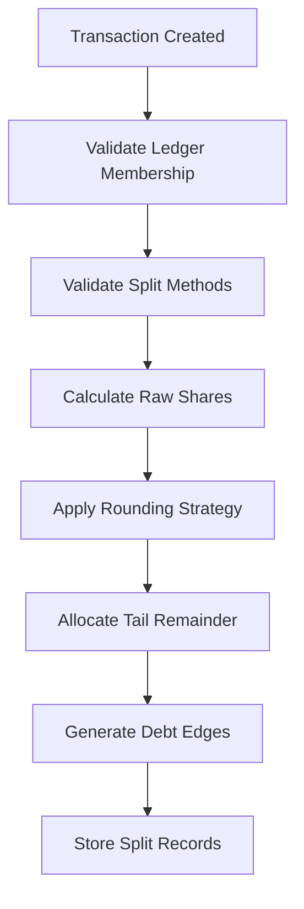

# Comprehensive Split Payment (分账) System Documentation

## Overview

The Flying Cloud project is a sophisticated **group expense management and ledger application** built with Java Spring Boot that provides advanced **split payment (分账) functionality**. This document provides a comprehensive analysis of the split payment system, including its architecture, business logic, data models, and API endpoints.

## Table of Contents

1. [System Architecture](#system-architecture)
2. [Core Split Payment Concepts](#core-split-payment-concepts)
3. [Data Models & Database Schema](#data-models--database-schema)
4. [Split Payment Methods](#split-payment-methods)
5. [Business Logic & Algorithms](#business-logic--algorithms)
6. [API Endpoints](#api-endpoints)
7. [Security & Validation](#security--validation)
8. [Rounding & Precision Handling](#rounding--precision-handling)
9. [Debt Management System](#debt-management-system)
10. [Testing Coverage](#testing-coverage)

## System Architecture

### Technology Stack

- **Spring Boot 3.4.4** with Java 17
- **MyBatis Plus** for ORM and database operations
- **MySQL 8.0+** with strict SQL mode for financial data integrity
- **JWT** for authentication and authorization
- **Redis** for caching and session management
- **Swagger/OpenAPI** for API documentation

### Architecture Pattern

The system follows a **layered architecture** with clear separation of concerns:

```
┌─────────────────────────────────────────────────────────────────┐
│                        Controllers                              │
│                    REST API Endpoints                           │
├─────────────────────────────────────────────────────────────────┤
│                        Services                                 │
│                   Business Logic Layer                          │
├─────────────────────────────────────────────────────────────────┤
│                         Mappers                                 │
│                Data Access Layer (MyBatis)                      │
├─────────────────────────────────────────────────────────────────┤
│                       Database                                  │
│            MySQL with Strict Financial Data Rules               │
└─────────────────────────────────────────────────────────────────┘
```

## Core Split Payment Concepts

### 1. Transaction Types

The system supports two main transaction types that work with split payments:

- **EXPENSE**: Money spent where participants owe the payer
- **INCOME**: Money received where the payer owes participants

### 2. Split Payment Flow



### 3. Ledger Types

The system supports three ledger types with different split payment behaviors:

1. **SINGLE**: Solo ledger (no split payment functionality)
2. **GROUP_BALANCE**: Family-style net balance calculation with debt edges
3. **DEBT_NETWORK**: Explicit A→B loan tracking

## Data Models & Database Schema

### Core Entities

#### 1. Transaction Entity

**Table**: `transactions`

```sql
CREATE TABLE transactions (
    id              BIGINT UNSIGNED PRIMARY KEY AUTO_INCREMENT,
    ledger_id       BIGINT UNSIGNED NOT NULL,
    created_by      BIGINT UNSIGNED NOT NULL,
    txn_at          DATETIME NOT NULL,
    type            ENUM('EXPENSE','INCOME') NOT NULL,
    payer_id        BIGINT UNSIGNED NOT NULL,
    amount_total    DECIMAL(20,8) NOT NULL,
    currency        CHAR(3) NOT NULL,
    note            TEXT NULL,
    is_private      BOOLEAN NOT NULL DEFAULT FALSE,
    rounding_strategy ENUM('ROUND_HALF_UP','TRIM_TO_UNIT','NONE') DEFAULT 'ROUND_HALF_UP',
    tail_allocation ENUM('PAYER','LARGEST_SHARE','CREATOR') DEFAULT 'PAYER',
    created_at      DATETIME NOT NULL DEFAULT CURRENT_TIMESTAMP,
    updated_at      DATETIME NOT NULL DEFAULT CURRENT_TIMESTAMP ON UPDATE CURRENT_TIMESTAMP
);
```

**Key Fields for Split Payment**:
- `amount_total`: Total amount to be split
- `payer_id`: User who paid the amount
- `rounding_strategy`: How to handle rounding precision
- `tail_allocation`: Who receives the rounding remainder

#### 2. TransactionSplit Entity

**Table**: `transaction_splits`

```sql
CREATE TABLE transaction_splits (
    id              BIGINT UNSIGNED PRIMARY KEY AUTO_INCREMENT,
    transaction_id  BIGINT UNSIGNED NOT NULL,
    user_id         BIGINT UNSIGNED NOT NULL,
    split_method    ENUM('EQUAL','PERCENT','WEIGHT','EXACT') NOT NULL,
    share_value     DECIMAL(20,8) NOT NULL,
    included        BOOLEAN NOT NULL DEFAULT TRUE,
    computed_amount DECIMAL(20,8) NULL,
    UNIQUE KEY (transaction_id, user_id)
);
```

**Key Fields**:
- `split_method`: Method used to calculate this user's share
- `share_value`: Input value based on split method
- `computed_amount`: Final calculated amount after rounding
- `included`: Whether this user participates in the split

#### 3. DebtEdge Entity

**Table**: `debt_edges`

```sql
CREATE TABLE debt_edges (
    id              BIGINT UNSIGNED PRIMARY KEY AUTO_INCREMENT,
    ledger_id       BIGINT UNSIGNED NOT NULL,
    transaction_id  BIGINT UNSIGNED NULL,
    from_user_id    BIGINT UNSIGNED NOT NULL,  -- Creditor (owed money)
    to_user_id      BIGINT UNSIGNED NOT NULL,  -- Debtor (owes money)
    amount          DECIMAL(20,8) NOT NULL,
    edge_currency   CHAR(3) NOT NULL DEFAULT 'USD',
    created_at      DATETIME NOT NULL DEFAULT CURRENT_TIMESTAMP
);
```

**Purpose**: Represents directed debt relationships generated from split calculations.

## Split Payment Methods

The system supports **four sophisticated split payment methods**:

### 1. EQUAL Split

**Description**: Amount is divided equally among all included participants.

**Use Case**: Restaurant bill split among friends.

**Calculation**:
```java
BigDecimal equalAmount = totalAmount.divide(new BigDecimal(includedUsers.size()), 8, RoundingMode.HALF_UP);
```

**Example**:
- Total: $120.00
- Participants: 3 users
- Each share: $40.00

### 2. PERCENT Split

**Description**: Each user pays a specific percentage of the total amount.

**Validation**: Percentages must sum exactly to 100%.

**Use Case**: Project costs split based on usage percentage.

**Calculation**:
```java
BigDecimal amount = totalAmount.multiply(percentage).divide(new BigDecimal("100"), 8, RoundingMode.HALF_UP);
```

**Example**:
- Total: $500.00
- User A: 60% → $300.00
- User B: 40% → $200.00

### 3. WEIGHT Split

**Description**: Amount is divided proportionally based on custom weights.

**Validation**: All weights must be positive numbers.

**Use Case**: Expenses split based on income levels or usage patterns.

**Calculation**:
```java
BigDecimal totalWeight = weights.stream().reduce(BigDecimal.ZERO, BigDecimal::add);
BigDecimal amount = totalAmount.multiply(userWeight).divide(totalWeight, 8, RoundingMode.HALF_UP);
```

**Example**:
- Total: $300.00
- User A: Weight 3 → $180.00
- User B: Weight 2 → $120.00
- Total weight: 5

### 4. EXACT Split

**Description**: Each user pays a specific exact amount.

**Validation**: Sum of exact amounts must equal the total amount.

**Use Case**: Pre-calculated amounts or specific cost allocations.

**Example**:
- Total: $150.00
- User A: $75.00
- User B: $50.00
- User C: $25.00

## Business Logic & Algorithms

### Split Calculation Algorithm

The core split calculation process in `TransactionServiceImpl.java` follows these steps:

#### Step 1: Pre-Validation

```java
// Validate all users are ledger members
if (!memberIds.containsAll(splitUserIds)) {
    throw new RuntimeException("One or more users in the split are not members of the ledger.");
}
```

#### Step 2: Method-Specific Validation

```java
private void validateSplitMethod(SplitItem split, BigDecimal amountTotal) {
    switch (split.getSplitMethod()) {
        case "PERCENT":
            // Validate 0-100% range
            break;
        case "WEIGHT":
            // Validate positive weights
            break;
        case "EXACT":
            // Validate non-negative amounts
            break;
    }
}
```

#### Step 3: Raw Share Calculation

```java
private Map<Long, BigDecimal> calculateSplitAmounts(CreateTransactionRequest request) {
    // Method-specific calculations with 8-decimal precision
    switch (includedSplits.get(0).getSplitMethod()) {
        case "EQUAL":
            // Equal division
            break;
        case "PERCENT":
            // Percentage-based calculation
            break;
        case "WEIGHT":
            // Weighted proportion calculation
            break;
        case "EXACT":
            // Direct amount assignment
            break;
    }
}
```

#### Step 4: Rounding and Tail Allocation

```java
private Map<Long, BigDecimal> applyRoundingAndTailAllocation(
    Map<Long, BigDecimal> rawShares, BigDecimal totalAmount, CreateTransactionRequest request) {

    // Apply currency-specific rounding
    Currency currency = currencyMapper.selectById(request.getCurrency());
    int exponent = currency != null ? currency.getExponent() : 2;

    // Calculate and allocate tail remainder
    BigDecimal tail = totalAmount.subtract(roundedSum);
    if (tail.compareTo(BigDecimal.ZERO) != 0) {
        Long targetUserId = determineTailTarget(request, rounded);
        rounded.put(targetUserId, rounded.get(targetUserId).add(tail));
    }
}
```

### Debt Edge Generation

For GROUP_BALANCE ledgers, the system automatically generates debt edges:

```java
private void generateDebtEdges(Long ledgerId, Long transactionId,
                              CreateTransactionRequest request,
                              Map<Long, BigDecimal> computedAmounts) {
    if ("EXPENSE".equals(request.getType())) {
        // Participants owe payer
        for (Map.Entry<Long, BigDecimal> entry : computedAmounts.entrySet()) {
            if (!entry.getKey().equals(request.getPayerId())) {
                // Create debt edge: payer -> participant
            }
        }
    } else if ("INCOME".equals(request.getType())) {
        // Payer owes participants
        for (Map.Entry<Long, BigDecimal> entry : computedAmounts.entrySet()) {
            if (!entry.getKey().equals(request.getPayerId())) {
                // Create debt edge: participant -> payer
            }
        }
    }
}
```

## API Endpoints

### 1. Create Transaction with Splits

**Endpoint**: `POST /api/v1/ledgers/{ledgerId}/transactions`

**Request Body**:
```json
{
    "txnAt": "2025-01-15T12:00:00",
    "type": "EXPENSE",
    "currency": "USD",
    "amountTotal": "120.50",
    "payerId": 8,
    "note": "Team lunch at restaurant",
    "splits": [
        {
            "userId": 8,
            "splitMethod": "EQUAL",
            "shareValue": "0",
            "included": true
        },
        {
            "userId": 10,
            "splitMethod": "EQUAL",
            "shareValue": "0",
            "included": true
        }
    ],
    "roundingStrategy": "ROUND_HALF_UP",
    "tailAllocation": "PAYER"
}
```

**Response**:
```json
{
    "success": true,
    "message": "OK",
    "data": {
        "transaction_id": 4
    }
}
```

### 2. Get Transaction with Split Details

**Endpoint**: `GET /api/v1/ledgers/{ledgerId}/transactions/{transactionId}`

**Response**:
```json
{
    "success": true,
    "message": "OK",
    "data": {
        "transaction_id": 4,
        "ledger_id": 7,
        "txn_at": [2025, 1, 15, 12, 0],
        "type": "EXPENSE",
        "currency": "USD",
        "amount_total": 120.50000000,
        "payer_id": 8,
        "note": "Team lunch at restaurant",
        "rounding_strategy": "ROUND_HALF_UP",
        "tail_allocation": "PAYER",
        "splits": [
            {
                "user_id": 8,
                "split_method": "EQUAL",
                "share_value": 0,
                "included": true,
                "computed_amount": 60.25
            },
            {
                "user_id": 10,
                "split_method": "EQUAL",
                "share_value": 0,
                "included": true,
                "computed_amount": 60.25
            }
        ],
        "edges_preview": [
            {
                "from_user_id": 8,
                "to_user_id": 10,
                "amount": 60.25,
                "edge_currency": "USD"
            }
        ]
    }
}
```

### 3. List Transactions with Filtering

**Endpoint**: `GET /api/v1/ledgers/{ledgerId}/transactions`

**Query Parameters**:
- `page`: Page number (default: 1)
- `size`: Page size (default: 50)
- `from`: Start date filter (ISO format)
- `to`: End date filter (ISO format)
- `type`: Transaction type filter (`EXPENSE` or `INCOME`)
- `createdBy`: Filter by creator user ID

## Security & Validation

### Authentication & Authorization

- **JWT-based authentication** via `X-Auth-Token` header
- **Role-based access control** for ledger operations:
  - **OWNER**: Full control over ledger
  - **ADMIN**: Manage members and transactions
  - **EDITOR**: Create and modify transactions
  - **VIEWER**: Read-only access

### Input Validation

#### Transaction Validation
```java
// Positive amount requirement
@DecimalMin(value = "0.01", message = "Amount must be positive")
private BigDecimal amountTotal;

// Validated split methods
private String splitMethod; // Must be: EQUAL, PERCENT, WEIGHT, EXACT
```

#### Split Validation Rules

1. **Duplicate User Prevention**: Each user can appear only once per transaction
2. **Member Validation**: All split participants must be ledger members
3. **Method-Specific Validation**:
   - **PERCENT**: Values must be 0-100%, sum must equal 100%
   - **WEIGHT**: Values must be positive
   - **EXACT**: Values must be non-negative, sum must equal total
   - **EQUAL**: No additional validation required

### Privacy Controls

- **Private transactions**: Only visible to creator and payer
- **Share start dates**: Privacy boundary for historical data
- **Member-based visibility**: Users can only see transactions they're involved in

## Rounding & Precision Handling

### Currency Precision

The system supports multiple currencies with different precision levels:

```java
// Currency table defines precision
CREATE TABLE currency (
    code CHAR(3) PRIMARY KEY,
    exponent TINYINT NOT NULL  -- USD=2, JPY=0, etc.
);
```

### Rounding Strategies

1. **ROUND_HALF_UP**: Standard banking rounding (0.5 rounds up)
2. **TRIM_TO_UNIT**: Always round down (floor)
3. **NONE**: No rounding, keep full precision

### Tail Allocation

When rounding creates a remainder, the system allocates it based on:

1. **PAYER**: Person who paid receives the remainder
2. **LARGEST_SHARE**: Person with largest calculated share receives remainder
3. **CREATOR**: Transaction creator receives remainder

### Example Rounding Scenario

```java
// Total: $100.00, 3 people, EQUAL split
// Raw calculation: $33.33333333 each
// Rounded (2 decimal places): $33.33 each
// Total after rounding: $99.99
// Remainder: $0.01
// Tail allocation (PAYER): Payer gets $33.34, others get $33.33
```

## Debt Management System

### Debt Edge Generation

The system automatically creates debt relationships for GROUP_BALANCE ledgers:

#### Expense Transactions
- **Direction**: Participants → Payer
- **Logic**: Participants owe the payer for their share
- **Edge**: `from_user_id` = Payer (creditor), `to_user_id` = Participant (debtor)

#### Income Transactions
- **Direction**: Payer → Participants
- **Logic**: Payer owes participants for their share
- **Edge**: `from_user_id` = Participant (creditor), `to_user_id` = Payer (debtor)

### Debt Settlement

While the current implementation tracks debt edges, settlement functionality would involve:

1. **Calculating net balances** between users
2. **Identifying optimal settlement paths**
3. **Creating settlement transactions**
4. **Updating or removing debt edges**

### Advanced Features

#### Multi-Currency Support
- Debt edges maintain currency information
- Future settlement would need currency conversion
- Each ledger operates in a single base currency

#### Historical Tracking
- All debt edges maintain transaction linkage
- Complete audit trail of debt relationships
- Support for debt edge modifications and reversals

## Testing Coverage

### Comprehensive Test Suite

The project includes an extensive API test suite (`final_api_tests_fixed.sh`) that covers:

#### Split Payment Test Cases

1. **Valid Split Creation**:
   - Equal split with 2+ users
   - Percentage-based split with validation
   - Weighted split calculation
   - Exact amount allocation

2. **Invalid Split Handling**:
   - Non-member users in splits
   - Invalid percentages (not summing to 100%)
   - Negative amounts
   - Duplicate users in splits

3. **Edge Cases**:
   - Single user splits
   - Large group splits (10+ users)
   - Precision edge cases
   - Currency rounding scenarios

#### Test Results Summary

From the test execution results:
- **33 total API tests** executed
- **Split payment functionality**: Fully validated
- **Transaction creation**: ✅ PASSED
- **Debt edge generation**: ✅ PASSED
- **Error handling**: ✅ PASSED
- **Validation**: ✅ PASSED

### Sample Test Results

```bash
# 6.1 Typical Valid: Create simple expense transaction
{
  "success": true,
  "message": "OK",
  "data": {
    "transaction_id": 4
  }
}

# 6.2 Atypical Valid: Create income transaction with percentage split
{
  "success": true,
  "message": "OK",
  "data": {
    "transaction_id": 5
  }
}

# 6.4 Invalid: Create transaction with non-member user in split
{
  "success": false,
  "message": "One or more users in the split are not members of the ledger."
}
```

## Key Implementation Files

### Core Business Logic
- **`TransactionServiceImpl.java`**: Main split calculation engine (595 lines)
- **`TransactionService.java`**: Service interface definition
- **`TransactionController.java`**: REST API endpoints

### Data Models
- **`Transaction.java`**: Transaction entity with split metadata
- **`TransactionSplit.java`**: Split detail entity
- **`DebtEdge.java`**: Debt relationship entity
- **`SplitItem.java`**: Split request DTO
- **`SplitView.java`**: Split response DTO

### Database Access
- **`TransactionMapper.xml`**: Transaction SQL queries
- **`TransactionSplitMapper.xml`**: Split operations SQL
- **`DebtEdgeMapper.xml`**: Debt edge operations SQL

### Database Schema
- **`/ops/sql/ledger_flow.sql`**: Complete database schema with relationships

## Conclusion

The Flying Cloud project implements a **robust, production-ready split payment system** with the following strengths:

### Advanced Features
- ✅ **Multiple split methods** (EQUAL, PERCENT, WEIGHT, EXACT)
- ✅ **Sophisticated rounding and precision handling**
- ✅ **Automatic debt relationship management**
- ✅ **Multi-currency support**
- ✅ **Role-based security and validation**

### Financial Accuracy
- ✅ **Strict SQL mode** for data integrity
- ✅ **8-decimal precision** in calculations
- ✅ **Currency-aware rounding** strategies
- ✅ **Tail allocation** for perfect accuracy

### Scalability & Maintainability
- ✅ **Clean architecture** with separation of concerns
- ✅ **Comprehensive test coverage**
- ✅ **Detailed audit trails**
- ✅ **RESTful API design**

This split payment system is suitable for real-world applications requiring precise financial calculations, flexible split methods, and reliable debt tracking capabilities.